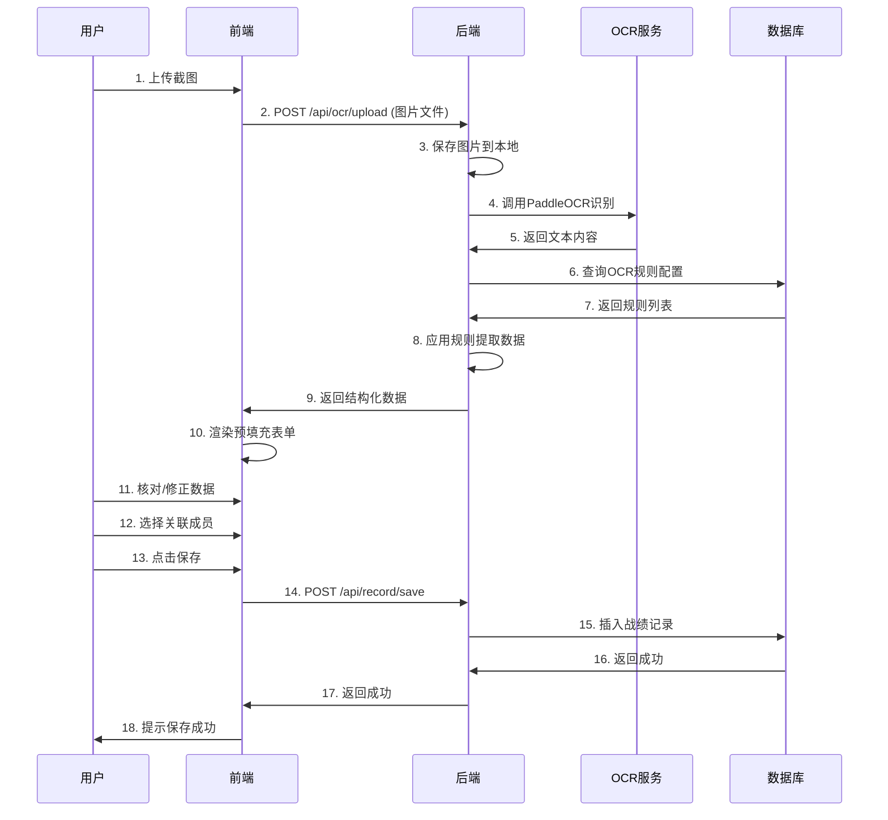

### **《咸鱼之王》智能管理平台 V1.0 需求分析文档（最终版）**

#### **1. 版本与核心目标**
- **版本：** V1.0 (核心功能优先)
- **核心目标：** 构建一个基于Web的B/S架构系统，通过集成PaddleOCR，实现**盐场战绩截图的一键识别与归档**，并提供一个集中的成员信息与资源日志管理界面，彻底告别手动录入Excel。
#### **2. 技术栈确认**

| 层级      | 技术选型             | 说明                |
| ------- | ---------------- | ----------------- |
| 前端框架    | Vue 3 + Vite     | 现代化、高性能           |
| UI组件库   | Element Plus     | 丰富的管理后台组件         |
| HTTP客户端 | Axios            | 接口请求封装            |
| 后端框架    | Spring Boot 2.7+ | 快速开发              |
| ORM框架   | MyBatis-Plus     | 简化CRUD操作          |
| 数据库     | MySQL 8.0        | 支持JSON字段          |
| OCR引擎   | PaddleOCR        | Python服务，HTTP接口调用 |
| 文件存储    | 本地存储             | 上传图片保存至本地         |

#### **3. 核心功能模块详细设计**

##### **模块一：成员档案管理**
- **功能描述：** 俱乐部成员的“人事档案库”。
- **核心功能点：**
    1. **成员列表与增删改查：** 提供完整的成员信息维护功能。
    2. **核心信息字段：** `游戏ID`、`战力`、`区服/俱乐部名`、`加入日期`。
    3. **扩展战力字段：** `四圣数量`、`红淬炼数量`、`金鱼数量`、`主C阵容`等，支持自定义扩展。
- **数据流向：** 是盐场战绩和成员资源日志的关联主体。
    
##### **模块二：智能战绩录入（核心MVP）**

- **功能描述：** 通过OCR技术，将图片战绩自动转化为结构化数据。
- **核心功能点：**
    1. **截图上传：** 支持单张或批量上传盐场战绩截图。
    2. **OCR规则配置：** 提供界面让您自定义关键词与字段的映射关系（如：关键词`杀敌` -> 字段`kills`）。
    3. **智能识别与填充：**
        - 后端调用PaddleOCR获取图片文本。
        - 前端规则引擎根据配置，自动提取数字并填充到表单。
    4. **人工核对与关联：** 识别结果经人工确认后，**手动选择关联到对应成员**，并保存至数据库。
##### **模块三：战绩数据看板**
- **功能描述：** 历史盐场数据的查询、统计与展示中心。
- **核心功能点：**
    1. **历史查询：** 按成员、日期查询历史战绩。
    2. **数据透视：** 提供对数据的排序、筛选功能（如：按KD值排序，筛选杀敌数大于N的成员）。
##### **模块四：资源日志系统（重要补充）**

- **功能描述：** 灵活记录与追踪个人、俱乐部或其他成员的资源变化。
- **核心功能点：**
    1. **灵活记录：**
        - 创建日志（如标题`【2024年11月资源盘点】`）。
        - **动态表单**记录任意资源（如`金砖`、`白玉`、`金鱼竿`、`梦魇晶石`）。
    2. **类型区分：** 可标记日志类型为`个人`、`俱乐部`或`成员`资源。若为`成员`资源，需关联具体成员。
    3. **智能对比：**
        - 选择不同时间点的两条日志，系统自动生成对比报告，展示资源差值及变化百分比。
            

---

#### 4. 数据库表结构设计

```
-- 1. 成员表
CREATE TABLE `club_member` (
  `id` INT NOT NULL AUTO_INCREMENT COMMENT '主键ID',
  `game_id` VARCHAR(50) NOT NULL COMMENT '游戏昵称/ID',
  `power` BIGINT NOT NULL DEFAULT 0 COMMENT '战力值',
  `server` VARCHAR(100) DEFAULT NULL COMMENT '区服/俱乐部名称',
  `join_date` DATE DEFAULT NULL COMMENT '加入日期',
  `four_sacred` INT DEFAULT 0 COMMENT '四圣数量',
  `red_refine` INT DEFAULT 0 COMMENT '红色淬炼数量',
  `gold_fish` INT DEFAULT 0 COMMENT '金色鱼竿数量',
  `main_lineup` TEXT DEFAULT NULL COMMENT '主C阵容描述',
  `custom_field_1` VARCHAR(200) DEFAULT NULL COMMENT '自定义扩展字段1',
  `custom_field_2` VARCHAR(200) DEFAULT NULL COMMENT '自定义扩展字段2',
  `created_at` DATETIME NOT NULL DEFAULT CURRENT_TIMESTAMP COMMENT '创建时间',
  `updated_at` DATETIME NOT NULL DEFAULT CURRENT_TIMESTAMP ON UPDATE CURRENT_TIMESTAMP COMMENT '更新时间',
  PRIMARY KEY (`id`),
  KEY `idx_game_id` (`game_id`)
) ENGINE=InnoDB DEFAULT CHARSET=utf8mb4 COMMENT='俱乐部成员信息表';

-- 2. 图片上传管理表（新增）
CREATE TABLE `upload_image` (
  `id` INT NOT NULL AUTO_INCREMENT COMMENT '主键ID',
  `original_name` VARCHAR(255) NOT NULL COMMENT '原始文件名',
  `storage_path` VARCHAR(500) NOT NULL COMMENT '服务器存储路径',
  `file_size` BIGINT NOT NULL DEFAULT 0 COMMENT '文件大小（字节）',
  `file_type` VARCHAR(20) NOT NULL COMMENT '文件类型（jpg/png/jpeg）',
  `image_width` INT DEFAULT 0 COMMENT '图片宽度（px）',
  `image_height` INT DEFAULT 0 COMMENT '图片高度（px）',
  `upload_type` ENUM('battle', 'resource', 'other') NOT NULL DEFAULT 'battle' COMMENT '上传类型',
  `upload_status` ENUM('uploaded', 'processing', 'processed', 'deleted') NOT NULL DEFAULT 'uploaded' COMMENT '上传状态',
  `md5_hash` VARCHAR(32) DEFAULT NULL COMMENT '文件MD5值',
  `created_at` DATETIME NOT NULL DEFAULT CURRENT_TIMESTAMP COMMENT '上传时间',
  PRIMARY KEY (`id`),
  KEY `idx_md5_hash` (`md5_hash`),
  KEY `idx_created_at` (`created_at`)
) ENGINE=InnoDB DEFAULT CHARSET=utf8mb4 COMMENT='图片上传管理表';

-- 3. OCR识别记录表（新增核心表）
CREATE TABLE `ocr_recognition_record` (
  `id` INT NOT NULL AUTO_INCREMENT COMMENT '主键ID',
  `image_id` INT NOT NULL COMMENT '关联图片ID',
  `image_url` VARCHAR(500) NOT NULL COMMENT '图片访问路径',
  `ocr_raw_text` TEXT DEFAULT NULL COMMENT 'OCR识别的原始文本',
  `extracted_data` JSON DEFAULT NULL COMMENT '提取的结构化数据',
  `recognition_status` ENUM('pending', 'success', 'failed') NOT NULL DEFAULT 'pending' COMMENT '识别状态',
  `recognition_time` INT DEFAULT 0 COMMENT '识别耗时（毫秒）',
  `error_message` TEXT DEFAULT NULL COMMENT '错误信息',
  `confidence_score` DECIMAL(5,2) DEFAULT 0.00 COMMENT 'OCR识别置信度',
  `is_confirmed` TINYINT(1) NOT NULL DEFAULT 0 COMMENT '是否已确认',
  `confirmed_record_id` INT DEFAULT NULL COMMENT '关联的战绩记录ID',
  `ocr_engine_version` VARCHAR(50) DEFAULT NULL COMMENT 'OCR引擎版本',
  `retry_count` INT NOT NULL DEFAULT 0 COMMENT '重试次数',
  `created_at` DATETIME NOT NULL DEFAULT CURRENT_TIMESTAMP COMMENT '识别开始时间',
  `updated_at` DATETIME NOT NULL DEFAULT CURRENT_TIMESTAMP ON UPDATE CURRENT_TIMESTAMP COMMENT '更新时间',
  PRIMARY KEY (`id`),
  KEY `idx_image_id` (`image_id`),
  KEY `idx_status` (`recognition_status`),
  KEY `idx_is_confirmed` (`is_confirmed`),
  KEY `idx_confirmed_record` (`confirmed_record_id`),
  KEY `idx_created_at` (`created_at`),
  CONSTRAINT `fk_ocr_image` FOREIGN KEY (`image_id`) REFERENCES `upload_image` (`id`) ON DELETE CASCADE
) ENGINE=InnoDB DEFAULT CHARSET=utf8mb4 COMMENT='OCR识别记录表';

-- 4. 盐场战绩表（修订）
CREATE TABLE `salt_field_record` (
  `id` INT NOT NULL AUTO_INCREMENT COMMENT '主键ID',
  `member_id` INT NOT NULL COMMENT '关联成员ID',
  `record_date` DATE NOT NULL COMMENT '活动日期',
  `kills` INT DEFAULT 0 COMMENT '杀敌数',
  `deaths` INT DEFAULT 0 COMMENT '死亡数',
  `digs` INT DEFAULT 0 COMMENT '刨地/刨击数',
  `revives` INT DEFAULT 0 COMMENT '复活丹使用次数',
  `kd_ratio` DECIMAL(10,2) DEFAULT 0.00 COMMENT 'KD战损比例',
  `ocr_record_id` INT DEFAULT NULL COMMENT '关联OCR识别记录ID',
  `image_url` VARCHAR(255) DEFAULT NULL COMMENT '截图存储路径',
  `data_source` ENUM('ocr', 'manual') NOT NULL DEFAULT 'ocr' COMMENT '数据来源',
  `created_at` DATETIME NOT NULL DEFAULT CURRENT_TIMESTAMP COMMENT '创建时间',
  PRIMARY KEY (`id`),
  KEY `idx_member_id` (`member_id`),
  KEY `idx_record_date` (`record_date`),
  KEY `idx_ocr_record` (`ocr_record_id`),
  CONSTRAINT `fk_record_member` FOREIGN KEY (`member_id`) REFERENCES `club_member` (`id`) ON DELETE CASCADE,
  CONSTRAINT `fk_record_ocr` FOREIGN KEY (`ocr_record_id`) REFERENCES `ocr_recognition_record` (`id`) ON DELETE SET NULL
) ENGINE=InnoDB DEFAULT CHARSET=utf8mb4 COMMENT='盐场战绩记录表';

-- 5. 资源日志表
CREATE TABLE `resource_log` (
  `id` INT NOT NULL AUTO_INCREMENT COMMENT '主键ID',
  `log_title` VARCHAR(200) NOT NULL COMMENT '日志标题',
  `log_type` ENUM('personal', 'club', 'member') NOT NULL COMMENT '日志类型',
  `member_id` INT DEFAULT NULL COMMENT '关联成员ID',
  `record_date` DATE NOT NULL COMMENT '记录日期',
  `resource_data` JSON NOT NULL COMMENT '资源数据',
  `notes` TEXT DEFAULT NULL COMMENT '备注说明',
  `created_at` DATETIME NOT NULL DEFAULT CURRENT_TIMESTAMP COMMENT '创建时间',
  `updated_at` DATETIME NOT NULL DEFAULT CURRENT_TIMESTAMP ON UPDATE CURRENT_TIMESTAMP COMMENT '更新时间',
  PRIMARY KEY (`id`),
  KEY `idx_log_type` (`log_type`),
  KEY `idx_record_date` (`record_date`),
  KEY `idx_member_id` (`member_id`),
  CONSTRAINT `fk_resource_member` FOREIGN KEY (`member_id`) REFERENCES `club_member` (`id`) ON DELETE SET NULL
) ENGINE=InnoDB DEFAULT CHARSET=utf8mb4 COMMENT='资源日志表';

-- 6. OCR规则配置表
CREATE TABLE `ocr_rule_config` (
  `id` INT NOT NULL AUTO_INCREMENT COMMENT '主键ID',
  `keyword` VARCHAR(50) NOT NULL COMMENT '识别关键词',
  `target_field` VARCHAR(50) NOT NULL COMMENT '目标字段名',
  `field_type` ENUM('int', 'decimal', 'string') NOT NULL DEFAULT 'int' COMMENT '字段类型',
  `is_active` TINYINT(1) NOT NULL DEFAULT 1 COMMENT '是否启用',
  `sort_order` INT DEFAULT 0 COMMENT '排序序号',
  `created_at` DATETIME NOT NULL DEFAULT CURRENT_TIMESTAMP COMMENT '创建时间',
  PRIMARY KEY (`id`),
  UNIQUE KEY `uk_keyword` (`keyword`)
) ENGINE=InnoDB DEFAULT CHARSET=utf8mb4 COMMENT='OCR规则配置表';

-- 初始化OCR规则数据
INSERT INTO `ocr_rule_config` (`keyword`, `target_field`, `field_type`, `is_active`, `sort_order`) VALUES
('杀敌', 'kills', 'int', 1, 1),
('死亡', 'deaths', 'int', 1, 2),
('刨击', 'digs', 'int', 1, 3),
('刨地', 'digs', 'int', 1, 4),
('复活丹', 'revives', 'int', 1, 5);
```
## 7. 系统架构设计

### 7.1 整体架构图
```
┌─────────────────────────────────────────────┐
│            前端层 (Vue3 + Element Plus)      │
│  ┌──────────┬──────────┬──────────┬────────┐│
│  │成员管理  │战绩录入  │数据看板  │资源日志││
│  └──────────┴──────────┴──────────┴────────┘│
└──────────────────┬──────────────────────────┘
                   │ HTTP/RESTful API
┌──────────────────▼──────────────────────────┐
│         后端层 (Spring Boot)                 │
│  ┌──────────┬──────────┬──────────┬────────┐│
│  │Controller│Service   │OCR引擎   │工具类  ││
│  └──────────┴──────────┴──────────┴────────┘│
└──────────────────┬──────────────────────────┘
                   │ JDBC/MyBatis
┌──────────────────▼──────────────────────────┐
│            数据层 (MySQL 8.0+)               │
│  [club_member] [salt_field_record]           │
│  [resource_log] [ocr_rule_config]            │
└─────────────────────────────────────────────┘

        ┌─────────────────┐
        │  PaddleOCR服务  │ ← HTTP调用
        └─────────────────┘
```


---

## 8. 详细交互流程设计

### 8.1 智能战绩录入完整流程



### 8.2 资源对比功能流程

```
[资源日志列表页]
    ↓ 用户勾选两条记录
[点击"对比"按钮]
    ↓ 前端请求
GET /api/resource/compare?id1=1&id2=2
    ↓ 后端处理
1. 查询两条记录的resource_data(JSON)
2. 解析JSON，计算差值
3. 计算变化百分比
4. 构建对比结果对象
    ↓ 返回前端
{
  "baseline": {...},  // 基准数据
  "current": {...},   // 对比数据
  "diff": {...},      // 差值
  "percentage": {...} // 百分比
}
    ↓ 前端渲染
展示对比报告（表格+图表）
```

---

## 9. 核心接口设计（RESTful API）

### 9.1 成员管理接口

| 接口                  | 方法     | 说明             |
| ------------------- | ------ | -------------- |
| `/club/member/list` | GET    | 分页查询成员列表       |
| `/club/member/{id}` | GET    | 获取成员详情         |
| `/club/member`      | POST   | 新增成员           |
| `/club/member`      | PUT    | 更新成员信息         |
| `/club/member/{id}` | DELETE | 删除成员,支持批量删除更实用 |

**请求示例 - 新增成员：**
```json
POST /club/member
{
  "gameId": "咸鱼大佬",
  "power": 1500000,
  "server": "S1-逍遥盐场",
  "joinDate": "2024-01-15",
  "fourSacred": 5,
  "redRefine": 12,
  "goldFish": 3,
  "mainLineup": "吕布/貂蝉/关羽"
}
```

### 9.2 智能战绩录入接口

| 接口                   | 方法   | 说明         |
| -------------------- | ---- | ---------- |
| `/club/ocr/upload`   | POST | 上传图片并OCR识别 |
| `/club/record/save`  | POST | 保存战绩记录     |
| `/club/record/list`  | GET  | 查询战绩列表     |
| `/club/record/stats` | GET  | 战绩统计分析     |

**请求示例 - OCR识别：**
```json
POST /club/ocr/upload
Content-Type: multipart/form-data

file: [二进制图片文件]
```

**响应示例：**
```json
{
  "code": 200,
  "msg": "识别成功",
  "data": {
    "ocrText": "杀敌：125\n死亡：3\n刨击：45\n复活丹：2",
    "extracted": {
      "kills": 125,
      "deaths": 3,
      "digs": 45,
      "revives": 2,
      "kdRatio": 41.67
    },
    "imageUrl": "/uploads/20240601_123456.jpg"
  }
}
```

### 9.3 资源日志接口

| 接口                           | 方法   | 说明     |
| ---------------------------- | ---- | ------ |
| `/club/resource/create`      | POST | 创建资源记录 |
| `/club/resource/list`        | GET  | 资源记录列表 |
| `/club/resource/detail/{id}` | GET  | 资源记录详情 |
| `/club/resource/update`      | PUT  | 更新资源记录 |
| `/club/resource/compare`     | GET  | 对比两条记录 |

**请求示例 - 创建资源记录：**
```json
POST /club/resource/create
{
  "logTitle": "【2024年12月资源盘点】",
  "logType": "personal",
  "recordDate": "2024-12-01",
  "resourceData": {
    "金砖": "180000",
    "白玉": "9500",
    "梦魇晶石": "150",
    "橙武精华": "3200"
  },
  "notes": "本月参加周赛4次，月赛1次"
}
```

### 9.4 OCR规则配置接口

| 接口                           | 方法   | 说明      |
| ---------------------------- | ---- | ------- |
| `/club/ocr-rule/list`        | GET  | 获取规则列表  |
| `/club/ocr-rule/save`        | POST | 保存规则配置  |
| `/club/ocr-rule/toggle/{id}` | PUT  | 启用/禁用规则 |

---

## 10. 前端页面结构设计

### 10.1 页面路由规划

```javascript
// router/index.js
const routes = [
  {
    path: '/',
    redirect: '/member'
  },
  {
    path: '/member',
    name: 'MemberManage',
    component: () => import('@/views/Member/Index.vue'),
    meta: { title: '成员管理' }
  },
  {
    path: '/record',
    name: 'RecordManage',
    component: () => import('@/views/Record/Index.vue'),
    meta: { title: '战绩录入' }
  },
  {
    path: '/dashboard',
    name: 'Dashboard',
    component: () => import('@/views/Dashboard/Index.vue'),
    meta: { title: '数据看板' }
  },
  {
    path: '/resource',
    name: 'ResourceLog',
    component: () => import('@/views/Resource/Index.vue'),
    meta: { title: '资源日志' }
  },
  {
    path: '/settings',
    name: 'Settings',
    component: () => import('@/views/Settings/OcrRule.vue'),
    meta: { title: 'OCR规则配置' }
  }
]
```

### 10.2 前端核心页面原型

#### 页面1：成员管理页面
```
┌─────────────────────────────────────────────────┐
│  成员管理                         [+ 新增成员]   │
├─────────────────────────────────────────────────┤
│ 搜索: [_________]  [查询] [重置]                │
├──┬────────┬────────┬──────┬──────┬──────────────┤
│□ │游戏ID  │战力    │区服  │四圣  │操作          │
├──┼────────┼────────┼──────┼──────┼──────────────┤
│□ │咸鱼大佬│1,500,000│S1   │5     │[编辑][删除]  │
│□ │盐场霸主│1,200,000│S2   │3     │[编辑][删除]  │
└──┴────────┴────────┴──────┴──────┴──────────────┘
                              [1] [2] [3] ... 共50条
```

#### 页面2：智能战绩录入页面
```
┌─────────────────────────────────────────────────┐
│  智能战绩录入                                    │
├─────────────────────────────────────────────────┤
│  【步骤1】上传截图                               │
│  ┌─────────────────┐                            │
│  │   [点击上传]    │ 或拖拽图片至此              │
│  │   📷 支持jpg/png │                            │
│  └─────────────────┘                            │
├─────────────────────────────────────────────────┤
│  【步骤2】OCR识别结果（可修改）                  │
│  杀敌数: [125  ]  死亡数: [3   ]               │
│  刨地数: [45   ]  复活丹: [2   ]               │
│  KD比例: [41.67] (自动计算)                     │
├─────────────────────────────────────────────────┤
│  【步骤3】关联成员                               │
│  选择成员: [咸鱼大佬 ▼]                         │
│  活动日期: [2024-12-01]                         │
├─────────────────────────────────────────────────┤
│  原始识别文本:                                   │
│  ┌───────────────────────────────────────┐     │
│  │杀敌：125                              │     │
│  │死亡：3                                │     │
│  │刨击：45                               │     │
│  └───────────────────────────────────────┘     │
│                         [保存战绩] [重新识别]   │
└─────────────────────────────────────────────────┘
```

#### 页面3：数据看板页面
```
┌─────────────────────────────────────────────────┐
│  战绩数据看板                                    │
├─────────────────────────────────────────────────┤
│  筛选条件:                                       │
│  成员: [全部 ▼]  日期: [2024-12 ▼]  [查询]    │
├─────────────────────────────────────────────────┤
│  📊 统计概览                                    │
│  ┌──────┬──────┬──────┬──────┐               │
│  │总场次│平均杀│最高KD│参与人│               │
│  │  24  │  98  │ 52.3 │  12  │               │
│  └──────┴──────┴──────┴──────┘               │
├──┬────────┬────┬────┬────┬────┬──────────────┤
│  │成员    │杀敌│死亡│刨地│KD  │记录日期      │
├──┼────────┼────┼────┼────┼────┼──────────────┤
│  │咸鱼大佬│125 │3   │45  │41.7│2024-12-01   │
│  │盐场霸主│108 │5   │38  │21.6│2024-12-01   │
└──┴────────┴────┴────┴────┴────┴──────────────┘
   支持导出Excel  [📥 导出]
```

#### 页面4：资源日志页面
```
[资源日志管理]
│
├── [功能按钮] [+ 新建记录] [对比分析] [导出报表]
│
├── [资源记录列表]
│   ├── 标题 | 类型 | 记录日期 | 主要资源 | 操作
│   ├── 2024年11月盘点 | 个人 | 2024-11-30 | 金砖:150k... | [查看][编辑][对比]
│   └── 2024年10月盘点 | 个人 | 2024-10-31 | 金砖:120k... | [查看][编辑][对比]
│
├── [新建/编辑资源记录]
│   ├── 基础信息
│   │   ├── 标题：[2024年11月资源盘点]
│   │   ├── 类型：(●)个人 ( )俱乐部 ( )成员
│   │   └── 日期：[2024-11-30]
│   │
│   ├── 资源数据（动态表单）
│   │   ├── 金砖：[150,000] [删除]
│   │   ├── 白玉：[8,500] [删除]
│   │   └── [+ 添加资源项]
│   │
│   └── 备注：[文本框]
│       [保存] [取消]
```

---

## 11. OCR识别规则引擎设计

### 11.1 规则匹配逻辑

```java
// 伪代码示例
public Map<String, Object> extractData(String ocrText, List<OcrRule> rules) {
    Map<String, Object> result = new HashMap<>();
    
    for (OcrRule rule : rules) {
        if (!rule.isActive()) continue;
        
        // 正则匹配：关键词 + 数字
        String pattern = rule.getKeyword() + "[：:](\\d+)";
        Pattern r = Pattern.compile(pattern);
        Matcher m = r.matcher(ocrText);
        
        if (m.find()) {
            String value = m.group(1);
            // 根据字段类型转换
            Object convertedValue = convertByType(value, rule.getFieldType());
            result.put(rule.getTargetField(), convertedValue);
        }
    }
    
    // 自动计算KD
    if (result.containsKey("kills") && result.containsKey("deaths")) {
        int kills = (int) result.get("kills");
        int deaths = (int) result.get("deaths");
        double kd = deaths > 0 ? (double) kills / deaths : kills;
        result.put("kdRatio", Math.round(kd * 100.0) / 100.0);
    }
    
    return result;
}
```

### 11.2 默认OCR规则配置

| ID | keyword | target_field | field_type | is_active |
|----|---------|-------------|------------|-----------|
| 1 | 杀敌 | kills | int | 1 |
| 2 | 死亡 | deaths | int | 1 |
| 3 | 刨击 | digs | int | 1 |
| 4 | 刨地 | digs | int | 1 |
| 5 | 复活丹 | revives | int | 1 |

---

## 12. 部署方案（本地运行）

### 12.1 环境准备

| 组件 | 版本要求 | 说明 |
|------|---------|------|
| JDK | 1.8+ | 推荐JDK 11 |
| MySQL | 8.0+ | 需支持JSON |
| Node.js | 16+ | 前端编译 |
| Python | 3.7+ | PaddleOCR运行环境 |
| PaddleOCR | 最新版 | 需单独安装 |

### 12.2 启动步骤

**Step 1: 启动MySQL数据库**
```bash
# 导入数据库脚本
mysql -u root -p < db/init.sql
```

**Step 2: 启动PaddleOCR服务**
```bash
cd paddleocr-service
pip install -r requirements.txt
python ocr_server.py  # 默认端口8866
```

**Step 3: 启动后端服务**
```bash
cd backend
mvn clean package
java -jar target/saltfish-platform-1.0.jar
# 默认端口8011
```

**Step 4: 启动前端服务**
```bash
cd frontend
npm install
npm run dev
# 默认端口5173
```

**访问地址：** `http://localhost:5173`

---
## 13 验收标准
✅ **功能验收：**
- [ ] 成员信息能正常增删改查
- [ ] 上传图片能正确OCR识别并提取数据
- [ ] 战绩数据能保存并在看板中查询统计
- [ ] 资源日志能创建并进行对比分析
- [ ] OCR规则可配置且生效
---
## 14. 未来扩展规划（V2.0+）
### 15.1 功能扩展
- 🔐 **用户登录系统**：多角色权限管理（管理员/成员/访客）
- 📱 **移动端适配**：响应式设计或独立H5页面
- 📊 **高级数据分析**：成员战力增长曲线、资源获取效率分析
- 🤖 **AI智能推荐**：根据历史数据推荐最佳出战阵容
- 🔔 **消息通知**：盐场活动提醒、战绩异常提醒

### 15.2 技术优化
- 🚀 部署到云服务器，支持多设备访问
- 📦 图片存储迁移到OSS对象存储
- 🔍 引入ElasticSearch实现全文检索
- 📈 接入数据可视化库（ECharts/G2）

---

## 16. 附录

### 16.1 术语表

| 术语    | 说明               |
| ----- | ---------------- |
| 盐场    | 游戏中的PVP战场活动      |
| KD    | Kill/Death，杀敌死亡比 |
| 刨地/刨击 | 游戏中的特定动作统计       |
| 四圣    | 游戏中的高级角色皮肤       |
| 淬炼    | 游戏中的装备强化系统       |

### 16.2 参考资料
- PaddleOCR官方文档：https://github.com/PaddlePaddle/PaddleOCR
- Spring Boot官方文档：https://spring.io/projects/spring-boot
- Vue3官方文档：https://vuejs.org/
- Element Plus文档：https://element-plus.org/

---

## 📝 文档修订记录

| 版本   | 日期         | 修订人 | 修订内容              |
| ---- | ---------- | --- | ----------------- |
| V1.0 | 2025-11-14 | lhb | 初始版本              |
| V1.1 | 2024-11-14 | lhb | 补充系统架构、接口设计、部署方案等 |

---